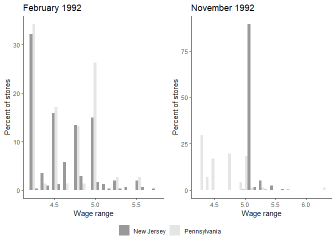
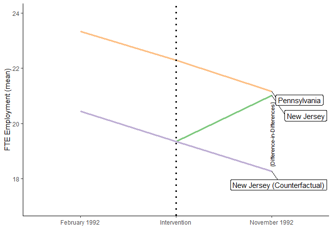

My R Notes for DID Estimator
================
Congli (Claire) Zhang
Starting at: 8/10/2021

## An extraordinary example replicating the Card and Krueger (1994) paper

The famous [Card and Krueger (1994)
paper](https://www.nber.org/papers/w4509) examines the effects of
minimum wages on employment. Philipp Leppert [replicates this study in
R](https://rpubs.com/phle/r_tutorial_difference_in_differences).

### Run the code

Dataset can be downloaded from [David Card’s
page](https://davidcard.berkeley.edu/data_sets.html).

``` r
# Temporary file and path
tfile_path <- tempfile()
tdir_path <- tempdir()

# Download zip file
download.file("http://davidcard.berkeley.edu/data_sets/njmin.zip", 
              destfile = tfile_path)

# Unzip
unzip(tfile_path, exdir = tdir_path)

# Read codebook
codebook <- readr::read_lines(file = paste0(tdir_path, "/codebook"))

# Generate a vector with variable names
variable_names <- codebook %>%
  `[`(8:59) %>% # Variablennamen starten bei Element 8 (sheet)
  `[`(-c(5, 6, 13, 14, 32, 33)) %>% # Elemente ohne Variablennamen entfernen
  str_sub(1, 8) %>% # längster Variablenname enthält 8 Zeichen
  str_squish() %>% # Whitespaces entfernen
  str_to_lower() # nur Kleinbuchstaben verwenden

# Generate a vector with variable labels
variable_labels <- codebook %>%
  `[`(8:59) %>% # variable names start at element 8 (sheet)
  `[`(-c(5, 6, 13, 14, 32, 33)) %>% # remove elements w/o variable names
  sub(".*\\.[0-9]", "", .) %>%
  `[`(-c(5:10))  %>% # these elements are combined later on
  str_squish() # remove white spaces
  
# Region
variable_labels[41] <- "region of restaurant"

# Read raw data
data_raw <- read_table2(paste0(tdir_path, "/public.dat"),
                        col_names = FALSE)
```

``` r
# Add variable names
data_mod <- data_raw %>%
  select(-X47) %>% # remove empty column
  `colnames<-`(., variable_names) %>% # Assign variable names
  mutate_all(as.numeric) %>% # treat all variables as numeric
  mutate(sheet = ifelse(sheet == 407 & chain == 4, 408, sheet)) # duplicated sheet id 407

# Process data (currently wide format)
data_mod <- data_mod %>%
  # chain value label
  mutate(chain = case_when(chain == 1 ~ "bk",
                           chain == 2 ~ "kfc",
                           chain == 3 ~ "roys",
                           chain == 4 ~ "wendys")) %>%
  # state value label
  mutate(state = case_when(state == 1 ~ "New Jersey",
                           state == 0 ~ "Pennsylvania")) %>%
  # Region dummy
  mutate(region = case_when(southj == 1 ~ "southj",
                            centralj == 1 ~ "centralj",
                            northj == 1 ~ "northj",
                            shore == 1 ~ "shorej",
                            pa1 == 1 ~ "phillypa",
                            pa2 == 1 ~ "eastonpa")) %>%
  # meals value label
  mutate(meals = case_when(meals == 0 ~ "none",
                           meals == 1 ~ "free meals",
                           meals == 2 ~ "reduced price meals",
                           meals == 3 ~ "both free and reduced price meals")) %>%
  # meals value label
  mutate(meals2 = case_when(meals2 == 0 ~ "none",
                            meals2 == 1 ~ "free meals",
                            meals2 == 2 ~ "reduced price meals",
                            meals2 == 3 ~ "both free and reduced price meals")) %>%
  # status2 value label
  mutate(status2 = case_when(status2 == 0 ~ "refused second interview",
                             status2 == 1 ~ "answered 2nd interview",
                             status2 == 2 ~ "closed for renovations",
                             status2 == 3 ~ "closed permanently",
                             status2 == 4 ~ "closed for highway construction",
                             status2 == 5 ~ "closed due to Mall fire")) %>%
  mutate(co_owned = if_else(co_owned == 1, "yes", "no")) %>%
  mutate(bonus = if_else(bonus == 1, "yes", "no")) %>%
  mutate(special2 = if_else(special2 == 1, "yes", "no")) %>%
  mutate(type2 = if_else(type2 == 1, "phone", "personal")) %>%
  select(-southj, -centralj, -northj, -shore, -pa1, -pa2) %>% # now included in region dummy
  mutate(date2 = lubridate::mdy(date2)) %>% # Convert date
  rename(open2 = open2r) %>% #Fit name to wave 1
  rename(firstinc2 = firstin2) %>% # Fit name to wave 1
  sjlabelled::set_label(variable_labels) # Add stored variable labels
```

The data is in a wide format. Need to tidy it.

``` r
# Structural variables
structure <- data_mod %>%
  select(sheet, chain, co_owned, state, region)

# Wave 1 variables
wave1 <- data_mod %>%
  select(-ends_with("2"), - names(structure)) %>%
  mutate(observation = "February 1992") %>%
  bind_cols(structure) 

# Wave 2 variables
wave2 <- data_mod %>%
  select(ends_with("2")) %>%
  rename_all(~str_remove(., "2"))  %>%
  mutate(observation = "November 1992") %>%
  bind_cols(structure) 

# Final dataset
card_krueger_1994 <- bind_rows(wave1, wave2) %>%
  select(sort(names(.))) %>% # Sort columns alphabetically
  sjlabelled::copy_labels(data_mod) # Restore variable labels
```

According to the paper, the full-time equivalents (FTE) consist of
full-time employees, managers and part-time employees (emptot). The
latter are multiplied by factor 0.5 before entering the calculation.
Also, generate the share of full-time employees of all FTE (pct_ftw).

``` r
card_krueger_1994_mod <- card_krueger_1994 %>%
  mutate(emptot = empft + nmgrs + 0.5 * emppt,
         pct_fte = empft / emptot * 100)
```

Some descriptive stats. Before get to Leppert’s code, I think
tbl_strata() does a pretty neat job here, except for one thing, the
table displays median and IQR for continuous variables and the changing
statistics code doesn’t seem to work - NEED FIX THIS LATER.

``` r
tbl_strata(card_krueger_1994_mod,
           strata = observation,
           .tbl_fun =
             ~ .x %>%
             tbl_summary(by = state, missing = "no") %>%
             add_n(),
           statistic = list(all_continuous() ~ "{mean} ({sd})",
                            all_categorical() ~ "{n} / {N} ({p}%)"))
```

<div id="alnelgfnxk" style="overflow-x:auto;overflow-y:auto;width:auto;height:auto;">
<style>html {
  font-family: -apple-system, BlinkMacSystemFont, 'Segoe UI', Roboto, Oxygen, Ubuntu, Cantarell, 'Helvetica Neue', 'Fira Sans', 'Droid Sans', Arial, sans-serif;
}

#alnelgfnxk .gt_table {
  display: table;
  border-collapse: collapse;
  margin-left: auto;
  margin-right: auto;
  color: #333333;
  font-size: 16px;
  font-weight: normal;
  font-style: normal;
  background-color: #FFFFFF;
  width: auto;
  border-top-style: solid;
  border-top-width: 2px;
  border-top-color: #A8A8A8;
  border-right-style: none;
  border-right-width: 2px;
  border-right-color: #D3D3D3;
  border-bottom-style: solid;
  border-bottom-width: 2px;
  border-bottom-color: #A8A8A8;
  border-left-style: none;
  border-left-width: 2px;
  border-left-color: #D3D3D3;
}

#alnelgfnxk .gt_heading {
  background-color: #FFFFFF;
  text-align: center;
  border-bottom-color: #FFFFFF;
  border-left-style: none;
  border-left-width: 1px;
  border-left-color: #D3D3D3;
  border-right-style: none;
  border-right-width: 1px;
  border-right-color: #D3D3D3;
}

#alnelgfnxk .gt_title {
  color: #333333;
  font-size: 125%;
  font-weight: initial;
  padding-top: 4px;
  padding-bottom: 4px;
  border-bottom-color: #FFFFFF;
  border-bottom-width: 0;
}

#alnelgfnxk .gt_subtitle {
  color: #333333;
  font-size: 85%;
  font-weight: initial;
  padding-top: 0;
  padding-bottom: 6px;
  border-top-color: #FFFFFF;
  border-top-width: 0;
}

#alnelgfnxk .gt_bottom_border {
  border-bottom-style: solid;
  border-bottom-width: 2px;
  border-bottom-color: #D3D3D3;
}

#alnelgfnxk .gt_col_headings {
  border-top-style: solid;
  border-top-width: 2px;
  border-top-color: #D3D3D3;
  border-bottom-style: solid;
  border-bottom-width: 2px;
  border-bottom-color: #D3D3D3;
  border-left-style: none;
  border-left-width: 1px;
  border-left-color: #D3D3D3;
  border-right-style: none;
  border-right-width: 1px;
  border-right-color: #D3D3D3;
}

#alnelgfnxk .gt_col_heading {
  color: #333333;
  background-color: #FFFFFF;
  font-size: 100%;
  font-weight: normal;
  text-transform: inherit;
  border-left-style: none;
  border-left-width: 1px;
  border-left-color: #D3D3D3;
  border-right-style: none;
  border-right-width: 1px;
  border-right-color: #D3D3D3;
  vertical-align: bottom;
  padding-top: 5px;
  padding-bottom: 6px;
  padding-left: 5px;
  padding-right: 5px;
  overflow-x: hidden;
}

#alnelgfnxk .gt_column_spanner_outer {
  color: #333333;
  background-color: #FFFFFF;
  font-size: 100%;
  font-weight: normal;
  text-transform: inherit;
  padding-top: 0;
  padding-bottom: 0;
  padding-left: 4px;
  padding-right: 4px;
}

#alnelgfnxk .gt_column_spanner_outer:first-child {
  padding-left: 0;
}

#alnelgfnxk .gt_column_spanner_outer:last-child {
  padding-right: 0;
}

#alnelgfnxk .gt_column_spanner {
  border-bottom-style: solid;
  border-bottom-width: 2px;
  border-bottom-color: #D3D3D3;
  vertical-align: bottom;
  padding-top: 5px;
  padding-bottom: 5px;
  overflow-x: hidden;
  display: inline-block;
  width: 100%;
}

#alnelgfnxk .gt_group_heading {
  padding: 8px;
  color: #333333;
  background-color: #FFFFFF;
  font-size: 100%;
  font-weight: initial;
  text-transform: inherit;
  border-top-style: solid;
  border-top-width: 2px;
  border-top-color: #D3D3D3;
  border-bottom-style: solid;
  border-bottom-width: 2px;
  border-bottom-color: #D3D3D3;
  border-left-style: none;
  border-left-width: 1px;
  border-left-color: #D3D3D3;
  border-right-style: none;
  border-right-width: 1px;
  border-right-color: #D3D3D3;
  vertical-align: middle;
}

#alnelgfnxk .gt_empty_group_heading {
  padding: 0.5px;
  color: #333333;
  background-color: #FFFFFF;
  font-size: 100%;
  font-weight: initial;
  border-top-style: solid;
  border-top-width: 2px;
  border-top-color: #D3D3D3;
  border-bottom-style: solid;
  border-bottom-width: 2px;
  border-bottom-color: #D3D3D3;
  vertical-align: middle;
}

#alnelgfnxk .gt_from_md > :first-child {
  margin-top: 0;
}

#alnelgfnxk .gt_from_md > :last-child {
  margin-bottom: 0;
}

#alnelgfnxk .gt_row {
  padding-top: 8px;
  padding-bottom: 8px;
  padding-left: 5px;
  padding-right: 5px;
  margin: 10px;
  border-top-style: solid;
  border-top-width: 1px;
  border-top-color: #D3D3D3;
  border-left-style: none;
  border-left-width: 1px;
  border-left-color: #D3D3D3;
  border-right-style: none;
  border-right-width: 1px;
  border-right-color: #D3D3D3;
  vertical-align: middle;
  overflow-x: hidden;
}

#alnelgfnxk .gt_stub {
  color: #333333;
  background-color: #FFFFFF;
  font-size: 100%;
  font-weight: initial;
  text-transform: inherit;
  border-right-style: solid;
  border-right-width: 2px;
  border-right-color: #D3D3D3;
  padding-left: 12px;
}

#alnelgfnxk .gt_summary_row {
  color: #333333;
  background-color: #FFFFFF;
  text-transform: inherit;
  padding-top: 8px;
  padding-bottom: 8px;
  padding-left: 5px;
  padding-right: 5px;
}

#alnelgfnxk .gt_first_summary_row {
  padding-top: 8px;
  padding-bottom: 8px;
  padding-left: 5px;
  padding-right: 5px;
  border-top-style: solid;
  border-top-width: 2px;
  border-top-color: #D3D3D3;
}

#alnelgfnxk .gt_grand_summary_row {
  color: #333333;
  background-color: #FFFFFF;
  text-transform: inherit;
  padding-top: 8px;
  padding-bottom: 8px;
  padding-left: 5px;
  padding-right: 5px;
}

#alnelgfnxk .gt_first_grand_summary_row {
  padding-top: 8px;
  padding-bottom: 8px;
  padding-left: 5px;
  padding-right: 5px;
  border-top-style: double;
  border-top-width: 6px;
  border-top-color: #D3D3D3;
}

#alnelgfnxk .gt_striped {
  background-color: rgba(128, 128, 128, 0.05);
}

#alnelgfnxk .gt_table_body {
  border-top-style: solid;
  border-top-width: 2px;
  border-top-color: #D3D3D3;
  border-bottom-style: solid;
  border-bottom-width: 2px;
  border-bottom-color: #D3D3D3;
}

#alnelgfnxk .gt_footnotes {
  color: #333333;
  background-color: #FFFFFF;
  border-bottom-style: none;
  border-bottom-width: 2px;
  border-bottom-color: #D3D3D3;
  border-left-style: none;
  border-left-width: 2px;
  border-left-color: #D3D3D3;
  border-right-style: none;
  border-right-width: 2px;
  border-right-color: #D3D3D3;
}

#alnelgfnxk .gt_footnote {
  margin: 0px;
  font-size: 90%;
  padding: 4px;
}

#alnelgfnxk .gt_sourcenotes {
  color: #333333;
  background-color: #FFFFFF;
  border-bottom-style: none;
  border-bottom-width: 2px;
  border-bottom-color: #D3D3D3;
  border-left-style: none;
  border-left-width: 2px;
  border-left-color: #D3D3D3;
  border-right-style: none;
  border-right-width: 2px;
  border-right-color: #D3D3D3;
}

#alnelgfnxk .gt_sourcenote {
  font-size: 90%;
  padding: 4px;
}

#alnelgfnxk .gt_left {
  text-align: left;
}

#alnelgfnxk .gt_center {
  text-align: center;
}

#alnelgfnxk .gt_right {
  text-align: right;
  font-variant-numeric: tabular-nums;
}

#alnelgfnxk .gt_font_normal {
  font-weight: normal;
}

#alnelgfnxk .gt_font_bold {
  font-weight: bold;
}

#alnelgfnxk .gt_font_italic {
  font-style: italic;
}

#alnelgfnxk .gt_super {
  font-size: 65%;
}

#alnelgfnxk .gt_footnote_marks {
  font-style: italic;
  font-weight: normal;
  font-size: 65%;
}
</style>
<table class="gt_table">
  
  <thead class="gt_col_headings">
    <tr>
      <th class="gt_col_heading gt_columns_bottom_border gt_left" rowspan="2" colspan="1"><strong>Characteristic</strong></th>
      <th class="gt_center gt_columns_top_border gt_column_spanner_outer" rowspan="1" colspan="3">
        <span class="gt_column_spanner"><strong>February 1992</strong></span>
      </th>
      <th class="gt_center gt_columns_top_border gt_column_spanner_outer" rowspan="1" colspan="3">
        <span class="gt_column_spanner"><strong>November 1992</strong></span>
      </th>
    </tr>
    <tr>
      <th class="gt_col_heading gt_columns_bottom_border gt_center" rowspan="1" colspan="1"><strong>N</strong></th>
      <th class="gt_col_heading gt_columns_bottom_border gt_center" rowspan="1" colspan="1"><strong>New Jersey</strong>, N = 331<sup class="gt_footnote_marks">1</sup></th>
      <th class="gt_col_heading gt_columns_bottom_border gt_center" rowspan="1" colspan="1"><strong>Pennsylvania</strong>, N = 79<sup class="gt_footnote_marks">1</sup></th>
      <th class="gt_col_heading gt_columns_bottom_border gt_center" rowspan="1" colspan="1"><strong>N</strong></th>
      <th class="gt_col_heading gt_columns_bottom_border gt_center" rowspan="1" colspan="1"><strong>New Jersey</strong>, N = 331<sup class="gt_footnote_marks">1</sup></th>
      <th class="gt_col_heading gt_columns_bottom_border gt_center" rowspan="1" colspan="1"><strong>Pennsylvania</strong>, N = 79<sup class="gt_footnote_marks">1</sup></th>
    </tr>
  </thead>
  <tbody class="gt_table_body">
    <tr><td class="gt_row gt_left">1 if cash bounty for new workers</td>
<td class="gt_row gt_center">410</td>
<td class="gt_row gt_center">78 (24%)</td>
<td class="gt_row gt_center">23 (29%)</td>
<td class="gt_row gt_center">0</td>
<td class="gt_row gt_center">0 (NA%)</td>
<td class="gt_row gt_center">0 (NA%)</td></tr>
    <tr><td class="gt_row gt_left">chain 1=bk; 2=kfc; 3=roys; 4=wendys</td>
<td class="gt_row gt_center">410</td>
<td class="gt_row gt_center"></td>
<td class="gt_row gt_center"></td>
<td class="gt_row gt_center">410</td>
<td class="gt_row gt_center"></td>
<td class="gt_row gt_center"></td></tr>
    <tr><td class="gt_row gt_left" style="text-align: left; text-indent: 10px;">bk</td>
<td class="gt_row gt_center"></td>
<td class="gt_row gt_center">136 (41%)</td>
<td class="gt_row gt_center">35 (44%)</td>
<td class="gt_row gt_center"></td>
<td class="gt_row gt_center">136 (41%)</td>
<td class="gt_row gt_center">35 (44%)</td></tr>
    <tr><td class="gt_row gt_left" style="text-align: left; text-indent: 10px;">kfc</td>
<td class="gt_row gt_center"></td>
<td class="gt_row gt_center">68 (21%)</td>
<td class="gt_row gt_center">12 (15%)</td>
<td class="gt_row gt_center"></td>
<td class="gt_row gt_center">68 (21%)</td>
<td class="gt_row gt_center">12 (15%)</td></tr>
    <tr><td class="gt_row gt_left" style="text-align: left; text-indent: 10px;">roys</td>
<td class="gt_row gt_center"></td>
<td class="gt_row gt_center">82 (25%)</td>
<td class="gt_row gt_center">17 (22%)</td>
<td class="gt_row gt_center"></td>
<td class="gt_row gt_center">82 (25%)</td>
<td class="gt_row gt_center">17 (22%)</td></tr>
    <tr><td class="gt_row gt_left" style="text-align: left; text-indent: 10px;">wendys</td>
<td class="gt_row gt_center"></td>
<td class="gt_row gt_center">45 (14%)</td>
<td class="gt_row gt_center">15 (19%)</td>
<td class="gt_row gt_center"></td>
<td class="gt_row gt_center">45 (14%)</td>
<td class="gt_row gt_center">15 (19%)</td></tr>
    <tr><td class="gt_row gt_left">1 if company owned</td>
<td class="gt_row gt_center">410</td>
<td class="gt_row gt_center">113 (34%)</td>
<td class="gt_row gt_center">28 (35%)</td>
<td class="gt_row gt_center">410</td>
<td class="gt_row gt_center">113 (34%)</td>
<td class="gt_row gt_center">28 (35%)</td></tr>
    <tr><td class="gt_row gt_left">date</td>
<td class="gt_row gt_center">0</td>
<td class="gt_row gt_center">NA to NA</td>
<td class="gt_row gt_center">NA to NA</td>
<td class="gt_row gt_center">410</td>
<td class="gt_row gt_center">1991-11-11 to 1992-12-31</td>
<td class="gt_row gt_center">1992-11-07 to 1992-12-30</td></tr>
    <tr><td class="gt_row gt_left"># full-time employees</td>
<td class="gt_row gt_center">404</td>
<td class="gt_row gt_center">6 (2, 11)</td>
<td class="gt_row gt_center">6 (2, 14)</td>
<td class="gt_row gt_center">398</td>
<td class="gt_row gt_center">6 (2, 13)</td>
<td class="gt_row gt_center">5 (1, 10)</td></tr>
    <tr><td class="gt_row gt_left"># part-time employees</td>
<td class="gt_row gt_center">406</td>
<td class="gt_row gt_center">16 (11, 25)</td>
<td class="gt_row gt_center">20 (13, 25)</td>
<td class="gt_row gt_center">400</td>
<td class="gt_row gt_center">16 (10, 25)</td>
<td class="gt_row gt_center">18 (12, 25)</td></tr>
    <tr><td class="gt_row gt_left">usual amount of first raise ($/hr)</td>
<td class="gt_row gt_center">367</td>
<td class="gt_row gt_center">0.25 (0.15, 0.25)</td>
<td class="gt_row gt_center">0.20 (0.15, 0.25)</td>
<td class="gt_row gt_center">330</td>
<td class="gt_row gt_center">0.20 (0.15, 0.25)</td>
<td class="gt_row gt_center">0.18 (0.13, 0.25)</td></tr>
    <tr><td class="gt_row gt_left">number hrs open per day</td>
<td class="gt_row gt_center">410</td>
<td class="gt_row gt_center">15.00 (11.50, 16.00)</td>
<td class="gt_row gt_center">16.00 (12.00, 16.50)</td>
<td class="gt_row gt_center">399</td>
<td class="gt_row gt_center">15.00 (12.00, 16.00)</td>
<td class="gt_row gt_center">15.25 (12.00, 17.00)</td></tr>
    <tr><td class="gt_row gt_left">months to usual first raise</td>
<td class="gt_row gt_center">379</td>
<td class="gt_row gt_center">13 (13, 26)</td>
<td class="gt_row gt_center">13 (13, 26)</td>
<td class="gt_row gt_center">344</td>
<td class="gt_row gt_center">26 (13, 26)</td>
<td class="gt_row gt_center">19 (13, 26)</td></tr>
    <tr><td class="gt_row gt_left">free/reduced price code (See below)</td>
<td class="gt_row gt_center">410</td>
<td class="gt_row gt_center"></td>
<td class="gt_row gt_center"></td>
<td class="gt_row gt_center">399</td>
<td class="gt_row gt_center"></td>
<td class="gt_row gt_center"></td></tr>
    <tr><td class="gt_row gt_left" style="text-align: left; text-indent: 10px;">both free and reduced price meals</td>
<td class="gt_row gt_center"></td>
<td class="gt_row gt_center">33 (10.0%)</td>
<td class="gt_row gt_center">7 (8.9%)</td>
<td class="gt_row gt_center"></td>
<td class="gt_row gt_center">20 (6.2%)</td>
<td class="gt_row gt_center">3 (3.8%)</td></tr>
    <tr><td class="gt_row gt_left" style="text-align: left; text-indent: 10px;">free meals</td>
<td class="gt_row gt_center"></td>
<td class="gt_row gt_center">71 (21%)</td>
<td class="gt_row gt_center">5 (6.3%)</td>
<td class="gt_row gt_center"></td>
<td class="gt_row gt_center">98 (31%)</td>
<td class="gt_row gt_center">10 (13%)</td></tr>
    <tr><td class="gt_row gt_left" style="text-align: left; text-indent: 10px;">none</td>
<td class="gt_row gt_center"></td>
<td class="gt_row gt_center">1 (0.3%)</td>
<td class="gt_row gt_center">0 (0%)</td>
<td class="gt_row gt_center"></td>
<td class="gt_row gt_center">2 (0.6%)</td>
<td class="gt_row gt_center">0 (0%)</td></tr>
    <tr><td class="gt_row gt_left" style="text-align: left; text-indent: 10px;">reduced price meals</td>
<td class="gt_row gt_center"></td>
<td class="gt_row gt_center">226 (68%)</td>
<td class="gt_row gt_center">67 (85%)</td>
<td class="gt_row gt_center"></td>
<td class="gt_row gt_center">201 (63%)</td>
<td class="gt_row gt_center">65 (83%)</td></tr>
    <tr><td class="gt_row gt_left">number of call-backs*</td>
<td class="gt_row gt_center">410</td>
<td class="gt_row gt_center"></td>
<td class="gt_row gt_center"></td>
<td class="gt_row gt_center">161</td>
<td class="gt_row gt_center"></td>
<td class="gt_row gt_center"></td></tr>
    <tr><td class="gt_row gt_left" style="text-align: left; text-indent: 10px;">0</td>
<td class="gt_row gt_center"></td>
<td class="gt_row gt_center">162 (49%)</td>
<td class="gt_row gt_center">46 (58%)</td>
<td class="gt_row gt_center"></td>
<td class="gt_row gt_center"></td>
<td class="gt_row gt_center"></td></tr>
    <tr><td class="gt_row gt_left" style="text-align: left; text-indent: 10px;">1</td>
<td class="gt_row gt_center"></td>
<td class="gt_row gt_center">32 (9.7%)</td>
<td class="gt_row gt_center">5 (6.3%)</td>
<td class="gt_row gt_center"></td>
<td class="gt_row gt_center">54 (42%)</td>
<td class="gt_row gt_center">17 (53%)</td></tr>
    <tr><td class="gt_row gt_left" style="text-align: left; text-indent: 10px;">2</td>
<td class="gt_row gt_center"></td>
<td class="gt_row gt_center">68 (21%)</td>
<td class="gt_row gt_center">27 (34%)</td>
<td class="gt_row gt_center"></td>
<td class="gt_row gt_center">35 (27%)</td>
<td class="gt_row gt_center">12 (38%)</td></tr>
    <tr><td class="gt_row gt_left" style="text-align: left; text-indent: 10px;">3</td>
<td class="gt_row gt_center"></td>
<td class="gt_row gt_center">52 (16%)</td>
<td class="gt_row gt_center">1 (1.3%)</td>
<td class="gt_row gt_center"></td>
<td class="gt_row gt_center">19 (15%)</td>
<td class="gt_row gt_center">1 (3.1%)</td></tr>
    <tr><td class="gt_row gt_left" style="text-align: left; text-indent: 10px;">4</td>
<td class="gt_row gt_center"></td>
<td class="gt_row gt_center">11 (3.3%)</td>
<td class="gt_row gt_center">0 (0%)</td>
<td class="gt_row gt_center"></td>
<td class="gt_row gt_center">10 (7.8%)</td>
<td class="gt_row gt_center">0 (0%)</td></tr>
    <tr><td class="gt_row gt_left" style="text-align: left; text-indent: 10px;">5</td>
<td class="gt_row gt_center"></td>
<td class="gt_row gt_center">2 (0.6%)</td>
<td class="gt_row gt_center">0 (0%)</td>
<td class="gt_row gt_center"></td>
<td class="gt_row gt_center">1 (0.8%)</td>
<td class="gt_row gt_center">1 (3.1%)</td></tr>
    <tr><td class="gt_row gt_left" style="text-align: left; text-indent: 10px;">6</td>
<td class="gt_row gt_center"></td>
<td class="gt_row gt_center">2 (0.6%)</td>
<td class="gt_row gt_center">0 (0%)</td>
<td class="gt_row gt_center"></td>
<td class="gt_row gt_center">3 (2.3%)</td>
<td class="gt_row gt_center">1 (3.1%)</td></tr>
    <tr><td class="gt_row gt_left" style="text-align: left; text-indent: 10px;">8</td>
<td class="gt_row gt_center"></td>
<td class="gt_row gt_center">2 (0.6%)</td>
<td class="gt_row gt_center">0 (0%)</td>
<td class="gt_row gt_center"></td>
<td class="gt_row gt_center">2 (1.6%)</td>
<td class="gt_row gt_center">0 (0%)</td></tr>
    <tr><td class="gt_row gt_left" style="text-align: left; text-indent: 10px;">7</td>
<td class="gt_row gt_center"></td>
<td class="gt_row gt_center"></td>
<td class="gt_row gt_center"></td>
<td class="gt_row gt_center"></td>
<td class="gt_row gt_center">1 (0.8%)</td>
<td class="gt_row gt_center">0 (0%)</td></tr>
    <tr><td class="gt_row gt_left" style="text-align: left; text-indent: 10px;">9</td>
<td class="gt_row gt_center"></td>
<td class="gt_row gt_center"></td>
<td class="gt_row gt_center"></td>
<td class="gt_row gt_center"></td>
<td class="gt_row gt_center">4 (3.1%)</td>
<td class="gt_row gt_center">0 (0%)</td></tr>
    <tr><td class="gt_row gt_left"># managers/ass't managers</td>
<td class="gt_row gt_center">404</td>
<td class="gt_row gt_center">3.00 (3.00, 4.00)</td>
<td class="gt_row gt_center">3.00 (3.00, 4.00)</td>
<td class="gt_row gt_center">404</td>
<td class="gt_row gt_center">3.00 (3.00, 4.00)</td>
<td class="gt_row gt_center">3.00 (3.00, 4.00)</td></tr>
    <tr><td class="gt_row gt_left">number of cash registers in store</td>
<td class="gt_row gt_center">404</td>
<td class="gt_row gt_center"></td>
<td class="gt_row gt_center"></td>
<td class="gt_row gt_center">388</td>
<td class="gt_row gt_center"></td>
<td class="gt_row gt_center"></td></tr>
    <tr><td class="gt_row gt_left" style="text-align: left; text-indent: 10px;">1</td>
<td class="gt_row gt_center"></td>
<td class="gt_row gt_center">1 (0.3%)</td>
<td class="gt_row gt_center">0 (0%)</td>
<td class="gt_row gt_center"></td>
<td class="gt_row gt_center">1 (0.3%)</td>
<td class="gt_row gt_center">0 (0%)</td></tr>
    <tr><td class="gt_row gt_left" style="text-align: left; text-indent: 10px;">2</td>
<td class="gt_row gt_center"></td>
<td class="gt_row gt_center">60 (18%)</td>
<td class="gt_row gt_center">19 (24%)</td>
<td class="gt_row gt_center"></td>
<td class="gt_row gt_center">55 (18%)</td>
<td class="gt_row gt_center">16 (21%)</td></tr>
    <tr><td class="gt_row gt_left" style="text-align: left; text-indent: 10px;">3</td>
<td class="gt_row gt_center"></td>
<td class="gt_row gt_center">104 (32%)</td>
<td class="gt_row gt_center">29 (37%)</td>
<td class="gt_row gt_center"></td>
<td class="gt_row gt_center">107 (34%)</td>
<td class="gt_row gt_center">31 (40%)</td></tr>
    <tr><td class="gt_row gt_left" style="text-align: left; text-indent: 10px;">4</td>
<td class="gt_row gt_center"></td>
<td class="gt_row gt_center">84 (26%)</td>
<td class="gt_row gt_center">19 (24%)</td>
<td class="gt_row gt_center"></td>
<td class="gt_row gt_center">70 (23%)</td>
<td class="gt_row gt_center">16 (21%)</td></tr>
    <tr><td class="gt_row gt_left" style="text-align: left; text-indent: 10px;">5</td>
<td class="gt_row gt_center"></td>
<td class="gt_row gt_center">51 (16%)</td>
<td class="gt_row gt_center">7 (9.0%)</td>
<td class="gt_row gt_center"></td>
<td class="gt_row gt_center">53 (17%)</td>
<td class="gt_row gt_center">7 (9.1%)</td></tr>
    <tr><td class="gt_row gt_left" style="text-align: left; text-indent: 10px;">6</td>
<td class="gt_row gt_center"></td>
<td class="gt_row gt_center">18 (5.5%)</td>
<td class="gt_row gt_center">4 (5.1%)</td>
<td class="gt_row gt_center"></td>
<td class="gt_row gt_center">20 (6.4%)</td>
<td class="gt_row gt_center">7 (9.1%)</td></tr>
    <tr><td class="gt_row gt_left" style="text-align: left; text-indent: 10px;">7</td>
<td class="gt_row gt_center"></td>
<td class="gt_row gt_center">4 (1.2%)</td>
<td class="gt_row gt_center">0 (0%)</td>
<td class="gt_row gt_center"></td>
<td class="gt_row gt_center">3 (1.0%)</td>
<td class="gt_row gt_center">0 (0%)</td></tr>
    <tr><td class="gt_row gt_left" style="text-align: left; text-indent: 10px;">8</td>
<td class="gt_row gt_center"></td>
<td class="gt_row gt_center">4 (1.2%)</td>
<td class="gt_row gt_center">0 (0%)</td>
<td class="gt_row gt_center"></td>
<td class="gt_row gt_center">2 (0.6%)</td>
<td class="gt_row gt_center">0 (0%)</td></tr>
    <tr><td class="gt_row gt_left">number of registers open at 11:00 am</td>
<td class="gt_row gt_center">398</td>
<td class="gt_row gt_center"></td>
<td class="gt_row gt_center"></td>
<td class="gt_row gt_center">383</td>
<td class="gt_row gt_center"></td>
<td class="gt_row gt_center"></td></tr>
    <tr><td class="gt_row gt_left" style="text-align: left; text-indent: 10px;">1</td>
<td class="gt_row gt_center"></td>
<td class="gt_row gt_center">20 (6.2%)</td>
<td class="gt_row gt_center">3 (3.9%)</td>
<td class="gt_row gt_center"></td>
<td class="gt_row gt_center">17 (5.5%)</td>
<td class="gt_row gt_center">5 (6.6%)</td></tr>
    <tr><td class="gt_row gt_left" style="text-align: left; text-indent: 10px;">2</td>
<td class="gt_row gt_center"></td>
<td class="gt_row gt_center">123 (38%)</td>
<td class="gt_row gt_center">21 (27%)</td>
<td class="gt_row gt_center"></td>
<td class="gt_row gt_center">120 (39%)</td>
<td class="gt_row gt_center">26 (34%)</td></tr>
    <tr><td class="gt_row gt_left" style="text-align: left; text-indent: 10px;">3</td>
<td class="gt_row gt_center"></td>
<td class="gt_row gt_center">126 (39%)</td>
<td class="gt_row gt_center">43 (56%)</td>
<td class="gt_row gt_center"></td>
<td class="gt_row gt_center">126 (41%)</td>
<td class="gt_row gt_center">41 (54%)</td></tr>
    <tr><td class="gt_row gt_left" style="text-align: left; text-indent: 10px;">4</td>
<td class="gt_row gt_center"></td>
<td class="gt_row gt_center">39 (12%)</td>
<td class="gt_row gt_center">9 (12%)</td>
<td class="gt_row gt_center"></td>
<td class="gt_row gt_center">29 (9.4%)</td>
<td class="gt_row gt_center">4 (5.3%)</td></tr>
    <tr><td class="gt_row gt_left" style="text-align: left; text-indent: 10px;">5</td>
<td class="gt_row gt_center"></td>
<td class="gt_row gt_center">12 (3.7%)</td>
<td class="gt_row gt_center">1 (1.3%)</td>
<td class="gt_row gt_center"></td>
<td class="gt_row gt_center">13 (4.2%)</td>
<td class="gt_row gt_center">0 (0%)</td></tr>
    <tr><td class="gt_row gt_left" style="text-align: left; text-indent: 10px;">6</td>
<td class="gt_row gt_center"></td>
<td class="gt_row gt_center">1 (0.3%)</td>
<td class="gt_row gt_center">0 (0%)</td>
<td class="gt_row gt_center"></td>
<td class="gt_row gt_center"></td>
<td class="gt_row gt_center"></td></tr>
    <tr><td class="gt_row gt_left" style="text-align: left; text-indent: 10px;">0</td>
<td class="gt_row gt_center"></td>
<td class="gt_row gt_center"></td>
<td class="gt_row gt_center"></td>
<td class="gt_row gt_center"></td>
<td class="gt_row gt_center">1 (0.3%)</td>
<td class="gt_row gt_center">0 (0%)</td></tr>
    <tr><td class="gt_row gt_left" style="text-align: left; text-indent: 10px;">7</td>
<td class="gt_row gt_center"></td>
<td class="gt_row gt_center"></td>
<td class="gt_row gt_center"></td>
<td class="gt_row gt_center"></td>
<td class="gt_row gt_center">1 (0.3%)</td>
<td class="gt_row gt_center">0 (0%)</td></tr>
    <tr><td class="gt_row gt_left">hour of opening</td>
<td class="gt_row gt_center">410</td>
<td class="gt_row gt_center">7.00 (7.00, 10.50)</td>
<td class="gt_row gt_center">7.00 (6.00, 10.00)</td>
<td class="gt_row gt_center">399</td>
<td class="gt_row gt_center">7.00 (7.00, 10.50)</td>
<td class="gt_row gt_center">7.00 (6.00, 10.00)</td></tr>
    <tr><td class="gt_row gt_left">% employees affected by new minimum</td>
<td class="gt_row gt_center">366</td>
<td class="gt_row gt_center">50 (15, 80)</td>
<td class="gt_row gt_center">50 (5, 75)</td>
<td class="gt_row gt_center">0</td>
<td class="gt_row gt_center">NA (NA, NA)</td>
<td class="gt_row gt_center">NA (NA, NA)</td></tr>
    <tr><td class="gt_row gt_left">price of entree, including tax</td>
<td class="gt_row gt_center">398</td>
<td class="gt_row gt_center">1.05 (0.95, 1.94)</td>
<td class="gt_row gt_center">0.94 (0.86, 1.16)</td>
<td class="gt_row gt_center">386</td>
<td class="gt_row gt_center">1.05 (0.94, 2.11)</td>
<td class="gt_row gt_center">0.91 (0.87, 1.05)</td></tr>
    <tr><td class="gt_row gt_left">price of small fries, including tax</td>
<td class="gt_row gt_center">393</td>
<td class="gt_row gt_center">0.95 (0.86, 1.02)</td>
<td class="gt_row gt_center">0.84 (0.77, 0.90)</td>
<td class="gt_row gt_center">382</td>
<td class="gt_row gt_center">0.95 (0.90, 1.04)</td>
<td class="gt_row gt_center">0.84 (0.80, 0.91)</td></tr>
    <tr><td class="gt_row gt_left">price of medium soda, including tax</td>
<td class="gt_row gt_center">402</td>
<td class="gt_row gt_center">1.06 (1.02, 1.11)</td>
<td class="gt_row gt_center">0.97 (0.94, 1.03)</td>
<td class="gt_row gt_center">388</td>
<td class="gt_row gt_center">1.05 (1.01, 1.11)</td>
<td class="gt_row gt_center">0.98 (0.95, 1.01)</td></tr>
    <tr><td class="gt_row gt_left">region of restaurant</td>
<td class="gt_row gt_center">410</td>
<td class="gt_row gt_center"></td>
<td class="gt_row gt_center"></td>
<td class="gt_row gt_center">410</td>
<td class="gt_row gt_center"></td>
<td class="gt_row gt_center"></td></tr>
    <tr><td class="gt_row gt_left" style="text-align: left; text-indent: 10px;">centralj</td>
<td class="gt_row gt_center"></td>
<td class="gt_row gt_center">63 (19%)</td>
<td class="gt_row gt_center">0 (0%)</td>
<td class="gt_row gt_center"></td>
<td class="gt_row gt_center">63 (19%)</td>
<td class="gt_row gt_center">0 (0%)</td></tr>
    <tr><td class="gt_row gt_left" style="text-align: left; text-indent: 10px;">eastonpa</td>
<td class="gt_row gt_center"></td>
<td class="gt_row gt_center">0 (0%)</td>
<td class="gt_row gt_center">43 (54%)</td>
<td class="gt_row gt_center"></td>
<td class="gt_row gt_center">0 (0%)</td>
<td class="gt_row gt_center">43 (54%)</td></tr>
    <tr><td class="gt_row gt_left" style="text-align: left; text-indent: 10px;">northj</td>
<td class="gt_row gt_center"></td>
<td class="gt_row gt_center">175 (53%)</td>
<td class="gt_row gt_center">0 (0%)</td>
<td class="gt_row gt_center"></td>
<td class="gt_row gt_center">175 (53%)</td>
<td class="gt_row gt_center">0 (0%)</td></tr>
    <tr><td class="gt_row gt_left" style="text-align: left; text-indent: 10px;">phillypa</td>
<td class="gt_row gt_center"></td>
<td class="gt_row gt_center">0 (0%)</td>
<td class="gt_row gt_center">36 (46%)</td>
<td class="gt_row gt_center"></td>
<td class="gt_row gt_center">0 (0%)</td>
<td class="gt_row gt_center">36 (46%)</td></tr>
    <tr><td class="gt_row gt_left" style="text-align: left; text-indent: 10px;">southj</td>
<td class="gt_row gt_center"></td>
<td class="gt_row gt_center">93 (28%)</td>
<td class="gt_row gt_center">0 (0%)</td>
<td class="gt_row gt_center"></td>
<td class="gt_row gt_center">93 (28%)</td>
<td class="gt_row gt_center">0 (0%)</td></tr>
    <tr><td class="gt_row gt_left">sheet number (unique store id)</td>
<td class="gt_row gt_center">410</td>
<td class="gt_row gt_center">215 (118, 318)</td>
<td class="gt_row gt_center">459 (418, 490)</td>
<td class="gt_row gt_center">410</td>
<td class="gt_row gt_center">215 (118, 318)</td>
<td class="gt_row gt_center">459 (418, 490)</td></tr>
    <tr><td class="gt_row gt_left">special</td>
<td class="gt_row gt_center">0</td>
<td class="gt_row gt_center">0 (NA%)</td>
<td class="gt_row gt_center">0 (NA%)</td>
<td class="gt_row gt_center">392</td>
<td class="gt_row gt_center">64 (20%)</td>
<td class="gt_row gt_center">18 (23%)</td></tr>
    <tr><td class="gt_row gt_left">status</td>
<td class="gt_row gt_center">0</td>
<td class="gt_row gt_center">0 (NA%)</td>
<td class="gt_row gt_center">0 (NA%)</td>
<td class="gt_row gt_center">410</td>
<td class="gt_row gt_center"></td>
<td class="gt_row gt_center"></td></tr>
    <tr><td class="gt_row gt_left" style="text-align: left; text-indent: 10px;">answered 2nd interview</td>
<td class="gt_row gt_center"></td>
<td class="gt_row gt_center"></td>
<td class="gt_row gt_center"></td>
<td class="gt_row gt_center"></td>
<td class="gt_row gt_center">321 (97%)</td>
<td class="gt_row gt_center">78 (99%)</td></tr>
    <tr><td class="gt_row gt_left" style="text-align: left; text-indent: 10px;">closed due to Mall fire</td>
<td class="gt_row gt_center"></td>
<td class="gt_row gt_center"></td>
<td class="gt_row gt_center"></td>
<td class="gt_row gt_center"></td>
<td class="gt_row gt_center">1 (0.3%)</td>
<td class="gt_row gt_center">0 (0%)</td></tr>
    <tr><td class="gt_row gt_left" style="text-align: left; text-indent: 10px;">closed for highway construction</td>
<td class="gt_row gt_center"></td>
<td class="gt_row gt_center"></td>
<td class="gt_row gt_center"></td>
<td class="gt_row gt_center"></td>
<td class="gt_row gt_center">1 (0.3%)</td>
<td class="gt_row gt_center">0 (0%)</td></tr>
    <tr><td class="gt_row gt_left" style="text-align: left; text-indent: 10px;">closed for renovations</td>
<td class="gt_row gt_center"></td>
<td class="gt_row gt_center"></td>
<td class="gt_row gt_center"></td>
<td class="gt_row gt_center"></td>
<td class="gt_row gt_center">2 (0.6%)</td>
<td class="gt_row gt_center">0 (0%)</td></tr>
    <tr><td class="gt_row gt_left" style="text-align: left; text-indent: 10px;">closed permanently</td>
<td class="gt_row gt_center"></td>
<td class="gt_row gt_center"></td>
<td class="gt_row gt_center"></td>
<td class="gt_row gt_center"></td>
<td class="gt_row gt_center">5 (1.5%)</td>
<td class="gt_row gt_center">1 (1.3%)</td></tr>
    <tr><td class="gt_row gt_left" style="text-align: left; text-indent: 10px;">refused second interview</td>
<td class="gt_row gt_center"></td>
<td class="gt_row gt_center"></td>
<td class="gt_row gt_center"></td>
<td class="gt_row gt_center"></td>
<td class="gt_row gt_center">1 (0.3%)</td>
<td class="gt_row gt_center">0 (0%)</td></tr>
    <tr><td class="gt_row gt_left">type</td>
<td class="gt_row gt_center">0</td>
<td class="gt_row gt_center">0 (NA%)</td>
<td class="gt_row gt_center">0 (NA%)</td>
<td class="gt_row gt_center">410</td>
<td class="gt_row gt_center"></td>
<td class="gt_row gt_center"></td></tr>
    <tr><td class="gt_row gt_left" style="text-align: left; text-indent: 10px;">personal</td>
<td class="gt_row gt_center"></td>
<td class="gt_row gt_center"></td>
<td class="gt_row gt_center"></td>
<td class="gt_row gt_center"></td>
<td class="gt_row gt_center">33 (10.0%)</td>
<td class="gt_row gt_center">6 (7.6%)</td></tr>
    <tr><td class="gt_row gt_left" style="text-align: left; text-indent: 10px;">phone</td>
<td class="gt_row gt_center"></td>
<td class="gt_row gt_center"></td>
<td class="gt_row gt_center"></td>
<td class="gt_row gt_center"></td>
<td class="gt_row gt_center">298 (90%)</td>
<td class="gt_row gt_center">73 (92%)</td></tr>
    <tr><td class="gt_row gt_left">starting wage ($/hr)</td>
<td class="gt_row gt_center">390</td>
<td class="gt_row gt_center">4.50 (4.25, 4.87)</td>
<td class="gt_row gt_center">4.50 (4.25, 5.00)</td>
<td class="gt_row gt_center">389</td>
<td class="gt_row gt_center">5.05 (5.05, 5.05)</td>
<td class="gt_row gt_center">4.50 (4.25, 4.90)</td></tr>
    <tr><td class="gt_row gt_left"># full-time employees</td>
<td class="gt_row gt_center">398</td>
<td class="gt_row gt_center">19 (14, 24)</td>
<td class="gt_row gt_center">20 (16, 27)</td>
<td class="gt_row gt_center">396</td>
<td class="gt_row gt_center">20 (14, 26)</td>
<td class="gt_row gt_center">20 (15, 26)</td></tr>
    <tr><td class="gt_row gt_left"># full-time employees</td>
<td class="gt_row gt_center">398</td>
<td class="gt_row gt_center">33 (14, 52)</td>
<td class="gt_row gt_center">32 (18, 49)</td>
<td class="gt_row gt_center">390</td>
<td class="gt_row gt_center">35 (16, 57)</td>
<td class="gt_row gt_center">29 (13, 42)</td></tr>
  </tbody>
  
  <tfoot>
    <tr class="gt_footnotes">
      <td colspan="7">
        <p class="gt_footnote">
          <sup class="gt_footnote_marks">
            <em>1</em>
          </sup>
           
          n (%); Range; Median (IQR)
          <br />
        </p>
      </td>
    </tr>
  </tfoot>
</table>
</div>

``` r
card_krueger_1994_mod %>%
  select(chain, state) %>%
  table() %>%
  prop.table(margin = 2)  %>%
  apply(MARGIN = 2,
        FUN = scales::percent_format(accuracy = 0.1)) %>%
  noquote
```

    ##         state
    ## chain    New Jersey Pennsylvania
    ##   bk     41.1%      44.3%       
    ##   kfc    20.5%      15.2%       
    ##   roys   24.8%      21.5%       
    ##   wendys 13.6%      19.0%

``` r
card_krueger_1994_mod %>%
  filter(observation == "February 1992") %>%
  group_by(state) %>%
  summarise(emptot = mean(emptot, na.rm = TRUE),
            pct_fte  = mean(pct_fte, na.rm = TRUE),
            wage_st = mean(wage_st, na.rm = TRUE),
            hrsopen = mean(hrsopen, na.rm = TRUE)) %>%
  pivot_longer(cols=-state, names_to = "variable") %>%
  pivot_wider(names_from = state, values_from = value)
```

                    ┌──────────────────────────────────────┐
                    │ variable   New Jersey   Pennsylvania │
                    ├──────────────────────────────────────┤
                    │ emptot          20.4           23.3  │
                    │ pct_fte         32.8           35    │
                    │ wage_st          4.61           4.63 │
                    │ hrsopen         14.4           14.5  │
                    └──────────────────────────────────────┘

Column names: variable, New Jersey, Pennsylvania

``` r
card_krueger_1994_mod %>%
  filter(observation == "November 1992") %>%
  group_by(state) %>%
  summarise(emptot = mean(emptot, na.rm = TRUE),
            pct_fte  = mean(pct_fte, na.rm = TRUE),
            wage_st = mean(wage_st, na.rm = TRUE),
            hrsopen = mean(hrsopen, na.rm = TRUE)) %>%
  pivot_longer(cols=-state, names_to = "variable") %>%
  pivot_wider(names_from = state, values_from = value)
```

                    ┌──────────────────────────────────────┐
                    │ variable   New Jersey   Pennsylvania │
                    ├──────────────────────────────────────┤
                    │ emptot          21             21.2  │
                    │ pct_fte         35.9           30.4  │
                    │ wage_st          5.08           4.62 │
                    │ hrsopen         14.4           14.7  │
                    └──────────────────────────────────────┘

Column names: variable, New Jersey, Pennsylvania

Figure 1 in the study; The authors created this figure with SAS and it
shows the distribution of the fast food restaurants’ wages grouped by
the federal states NJ and PA before and after the treatment.

``` r
hist.feb <- card_krueger_1994_mod %>%
  filter(observation == "February 1992") %>%
  ggplot(aes(wage_st, fill = state)) +
  geom_histogram(aes(y=c(..count..[..group..==1]/sum(..count..[..group..==1]),
                         ..count..[..group..==2]/sum(..count..[..group..==2]))*100),
                 alpha=0.5, position = "dodge", bins = 23) +
  labs(title = "February 1992", x = "Wage range", y = "Percent of stores", fill = "") +
  scale_fill_grey()

hist.nov <- card_krueger_1994_mod %>%
  filter(observation == "November 1992") %>%
  ggplot(aes(wage_st, fill = state)) +
  geom_histogram(aes(y=c(..count..[..group..==1]/sum(..count..[..group..==1]),
                         ..count..[..group..==2]/sum(..count..[..group..==2]))*100),
                 alpha = 0.5, position = "dodge", bins = 23) +
  labs(title = "November 1992", x="Wage range", y = "Percent of stores", fill="") +
  scale_fill_grey()

ggpubr::ggarrange(hist.feb, hist.nov, ncol = 2, 
                  common.legend = TRUE, legend = "bottom")
```



Visualizing DID

-   first differences; obtain four means: treat-before, control-before,
    treat-after, control-after

``` r
differences <- card_krueger_1994_mod %>%
  group_by(observation, state) %>%
  summarise(emptot = mean(emptot, na.rm = TRUE))

# Treatment group (NJ) before treatment
njfeb <- differences[1,3]

# Control group (PA) before treatment
pafeb <- differences[2,3]

# Treatment group (NJ) after treatment
njnov <- differences[3,3]

# Control group (PA) after treatment
panov <- differences[4,3]
```

-   ATT, which is the difference between the difference of November and
    February within NJ and PA. two results should be identical

``` r
(njnov-njfeb)-(panov-pafeb) 
```

                               ┌────────────────┐
                               │         emptot │
                               ├────────────────┤
                               │           2.75 │
                               └────────────────┘

Column names: emptot

``` r
(njnov-panov)-(njfeb-pafeb)
```

                               ┌────────────────┐
                               │         emptot │
                               ├────────────────┤
                               │           2.75 │
                               └────────────────┘

Column names: emptot

-   visualizing ATT

``` r
# Calculate counterfactual outcome
nj_counterfactual <- tibble(
  observation = c("February 1992","November 1992"), 
  state = c("New Jersey (Counterfactual)","New Jersey (Counterfactual)"),
  emptot = as.numeric(c(njfeb, njfeb-(pafeb-panov)))
  ) 

# Data points for treatment event
intervention <- tibble(
    observation = c("Intervention", "Intervention", "Intervention"),
    state = c("New Jersey", "Pennsylvania", "New Jersey (Counterfactual)"),
    emptot = c(19.35, 22.3, 19.35)
  ) 

# Combine data
did_plotdata <- bind_rows(differences, 
                          nj_counterfactual, 
                          intervention)
did_plotdata %>%
  mutate(label = if_else(observation == "November 1992", as.character(state), NA_character_)) %>%
  ggplot(aes(x=observation,y=emptot, group=state)) +
  geom_line(aes(color=state), size=1.2) +
  geom_vline(xintercept = "Intervention", linetype="dotted", 
             color = "black", size=1.1) + 
  scale_color_brewer(palette = "Accent") +
  scale_y_continuous(limits = c(17,24)) +
  ggrepel::geom_label_repel(aes(label = label),
                   nudge_x = 0.5, nudge_y = -0.5,
                   na.rm = TRUE) +
  guides(color=FALSE) +
  labs(x="", y="FTE Employment (mean)") +
  annotate(
    "text",
    x = "November 1992",
    y = 19.6,
    label = "{Difference-in-Differences}",
    angle = 90,
    size = 3
  )
```



Finally, get to the DID estimator,

``` r
card_krueger_1994_mod <- mutate(card_krueger_1994_mod,
                                time = ifelse(observation == "November 1992", 1, 0),
                                treated = ifelse(state == "New Jersey", 1, 0)
                                )

lm(emptot ~ time + treated + time:treated, data = card_krueger_1994_mod) %>% 
  huxtable::huxreg()
```

               ─────────────────────────────────────────────────
                                                           (1)  
                                       ─────────────────────────
                 (Intercept)                        23.331 ***  
                                                    (1.072)     
                 time                               -2.166      
                                                    (1.516)     
                 treated                            -2.892 *    
                                                    (1.194)     
                 time:treated                        2.754      
                                                    (1.688)     
                                       ─────────────────────────
                 N                                 794          
                 R2                                  0.007      
                 logLik                          -2904.230      
                 AIC                              5818.460      
               ─────────────────────────────────────────────────
                 *** p < 0.001; ** p < 0.01; * p < 0.05.        

Column names: names, model1

To more precisely estimate, add sheet fixed-effects, for some reason,
Leppert’s code doesn’t work for me. I’ll go ahead using fixest package
to obtain same results.

``` r
# # Declare as panel data
# panel <- pdata.frame(card_krueger_1994_mod, "sheet")
# 
# # Within model
# did.reg <- plm::plm(emptot ~ time + treated + time:treated,
#                     data = panel, 
#                     model = "within")
# 
# # obtain clustered standard errors
# lmtest::coeftest(did.reg, vcov = function(x) 
#   vcovHC(x, cluster = "group", type = "HC1"))
```

``` r
feols(emptot ~ time + treated + time:treated | sheet,
      card_krueger_1994_mod) %>% 
  huxreg()
```

               ─────────────────────────────────────────────────
                                                           (1)  
                                       ─────────────────────────
                 time                                 -2.283    
                                                      (1.248)   
                 time:treated                          2.750 *  
                                                      (1.338)   
                                       ─────────────────────────
                 N                                   794        
                 R2                                    0.782    
                 logLik                            -2302.734    
                 AIC                                5429.468    
               ─────────────────────────────────────────────────
                 *** p < 0.001; ** p < 0.01; * p < 0.05.        

Column names: names, model1
